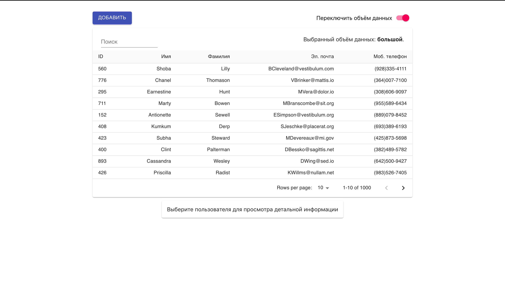
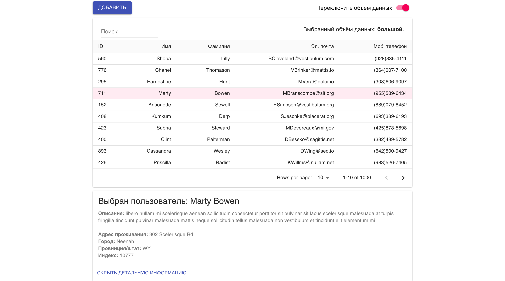
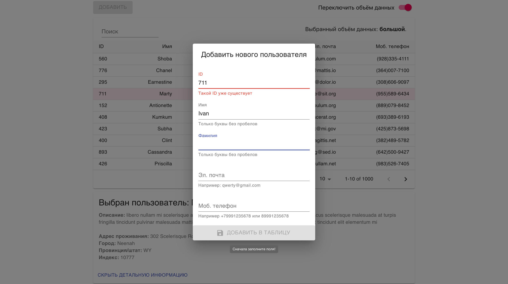

# Future_test_task
Тестовое задание на позицию junior frontend разработчика 
Описание задания: <a>https://github.com/fugr-ru/frontend-javascript-test</a>

<h2>Запуск через Docker</h2>
1) `docker build -t sample:dev .`
2) `docker run -v ${PWD}:/app -v /app/node_modules -p 3001:3000 --rm sample:dev` или `docker-compose up -d --build`

<h2>Скришоты</h2>
<h4>Внешний вид приложения</h4>

<h4>При выделении пользователя</h4>

<h4>Добавление нового пользователя</h4>

